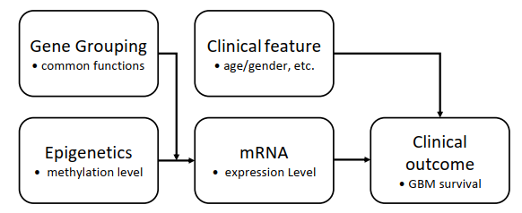
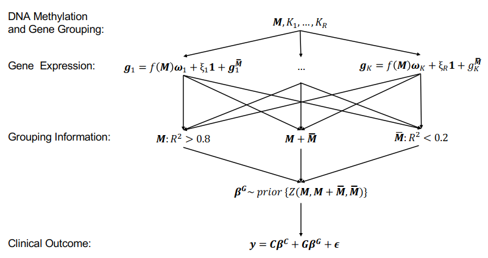

```{r, include = FALSE}
knitr::opts_chunk$set(
  collapse = TRUE,
  comment = "#>"
)
```

```{r setup, echo=FALSE, results=FALSE, message=FALSE}
library(EMMultiOmics)
```

## Outline

- Purpose of the package
- Brief explanation of the algorithms and workflow
- description of example data used
- DAVID functional classification tool
- 1st stage modeling with `EMVS()`
- 2nd stage modeling with `NEG_em()`
- summary of the model results and plots

## 1. Purpose

With the increasing availability of biomedical data from multiple platforms of the same patients in clinical research, such as epigenomics, gene expression, and clinical features, there is a growing need for statistical methods that can jointly analyze data from different platforms to provide complementary information for clinical studies. EMMultiOmics package utilizes a two-stage hierarchical Bayesian model that integrates high-dimensional biomedical data from diverse platforms to select biomarkers associated with clinical outcomes of interest.

In the first stage, we use Expectation Maximization based approach to learn the regulating mechanism between epigenomics (e.g., gene methylation) and gene expression while considering functional gene annotations. In the second stage, we group genes based on the regulating mechanism learned in the first stage. Then, we apply a group-wise penalty to select genes significantly associated with clinical outcomes while incorporating clinical features. 

## 2. Algorithms

(need details..)





## 3. example data

The package exports an example data - a Glioblastoma (GBM) dataset (from...). The example gene symbols used are exported in an object `eg_gene_symbols.` To obtain gene grouping, we need to get functional classification of the genes using DAVID tool.

(Also give a brief overview of the dataset if possible. e.g. clinical info, methylation, Gene expression, Y, ...)

## 4. David functional classifcation tool

`vignette("gene_grouping")`

Once the classification file is downloaded as txt, use `get_grouping()` function to obtain the gene grouping.

```{r, eval=FALSE}
fp <- system.file("eg_fx_classification.txt", package="EMMultiOmics")
gene_grouping <- get_grouping(eg_gene_symbols, fp)
gene_grouping
```

## 5. First Stage Data Integration Model (FSDIM)

In the first stage, we will combine information from methylation, gene expression, and gene
function annotation data to group genes based on how their expressions are regulated by DNA
methylation.

FSDIM aims to combine information from methylation `M`, gene expression `G`, and gene function annotation data (functional classification) to group genes based on how their expressions are regulated by DNA methylation. Essentially, Essentially, we divide the given K genes into three groups: (1) genes that are modulated by only DNA methylation (M type effect); (2) genes that are modulated by aspects other than DNA methylation (M¯ type effect); (3) genes that are modulated jointly by DNA methylation and aspects other than DNA methylation.Genes will be assigned group membership depending on the coefficient of determination, R2 of FSDIM.

The functional classification used in FDSIM is obtained from Database for Annotation, Visualization, and Integrated Discovery ([DAVID](https://david.ncifcrf.gov)). 

(example code on how to use `EMVS`)
```{r, eval=FALSE}
# example data
M <- GBM_data2$M
G <- GBM_data2$G
grouping <- GENE_GROUP2

EMVS(M, G, grouping, I=10, thresh=0.001)
```


## 6. Second Stage Data Integration Model (SSDIM)

SSDIM is a linear model that can be used to detect biomarkers associated with the clinical outcome `Y` of interest while considering the knowledge learned from FSDIM. It regresses clinical outcome of interest on relevant clinical features `C` and gene expression `G`, regularized with a group penalty reflecting methylation regulating mechanism and gene functional similarity learned from FSDIM. In this way, the SSDIM further integrates clinical outcomes to develop a unified way of combining and curating the set of predictor variables with the clinical responses.

(example code on how to use `NEG_em`, may change as necessary)
```{r, eval=FALSE}
G <- GBM_data2$G
Y <- GBM_data2$Y
C <- GBM_data2$C
R2 <- GBM2_EMVS_res$R2
Zmatrix <- Zmat_builder(R2, G)
a0 <- 0.1
gstr <- "scale"
mpmath <- setup_mpmath()

NEG_em(Y, G, C, a0, gstr, Zmatrix,
       I=10, thresh=0.001, .mpmath=mpmath)
```

## 7. summary

(walkthrough on how to use `multiomics` and `multiomics.sensitivity` to create summary output/tables/plots...)

