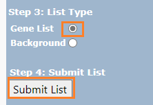

```{r, include = FALSE}
knitr::opts_chunk$set(
  collapse = TRUE,
  comment = "#>"
)
```

```{r setup, echo=FALSE, results=FALSE, message=FALSE}
library(EMMultiOmics)
```

`EMVS()` function requires `grouping` as a parameter. For a given set of genes, we can come up with a functional classification (or a "grouping") of the genes. One tool we suggest is the [DAVID Functional Classification tool](https://david.ncifcrf.gov/gene2gene.jsp). Here, we provide a brief tutorial on how to obtain gene grouping using this tool.

## Step 1. Enter Gene List
`EMMMultiOmics` package exports an example of gene names from official symbols. Run the following command to save them in your local environment. `writeLines(eg_gene_symbols, gene_names.txt)` Then, either copy and paste the list directly or upload it on DAVID Functional Classification Tool.


## Step 2. Choose Gene ID Type
Next, we need to specify the ID Type of the genes entered. Our example uses the OFFICIAL GENE SYMBOL. If you know the species of the genes, you can specify in Step 2a. Our genes are Homo Sapiens.


## Step 3. Submit and Download
Then we specify the List Type and submit. The Tool will return the classification result. You many download it as a txt file. (Click DownLoad File -> Right click on browser -> Save as...)




## Step 4. Get Grouping
Once the classification file is downloaded as txt, use `get_grouping()` function to obtain the gene grouping.
```{r, eval=FALSE}
fp <- system.file("eg_fx_classification.txt", package="EMMultiOmics")
gene_grouping <- get_grouping(eg_gene_symbols, fp)
gene_grouping
```


